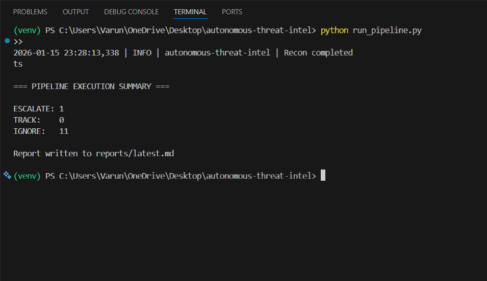
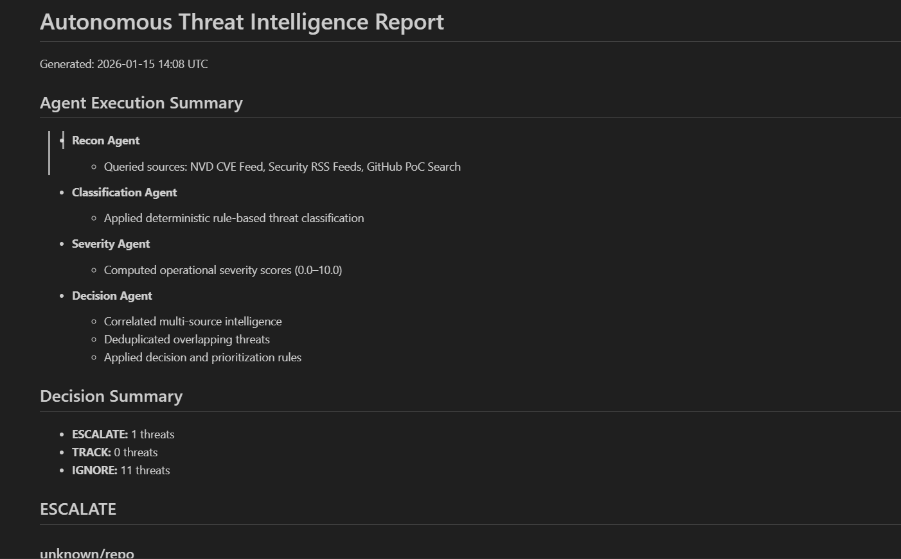
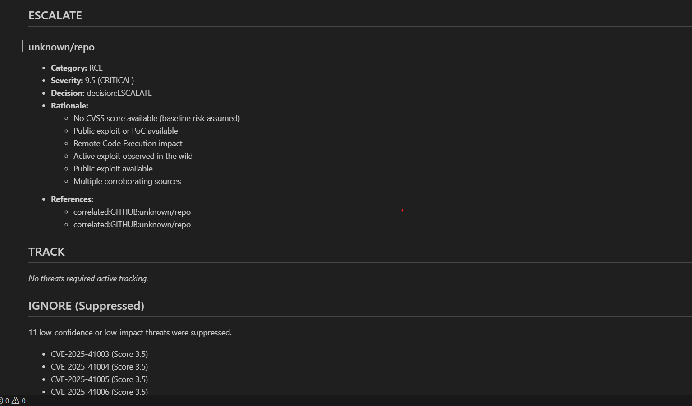
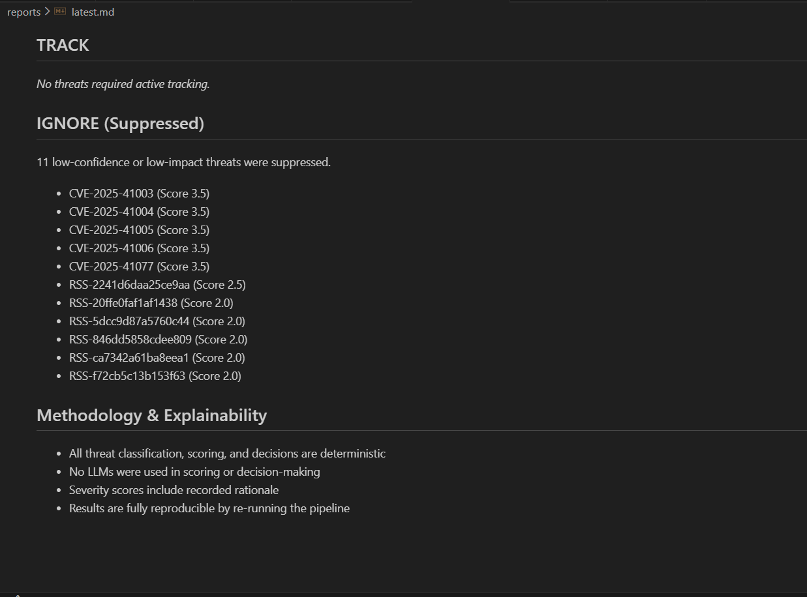

#  Autonomous Cyber Threat Intelligence Automation

> **Next-Generation Cyber Intelligence Pipeline: From Chaos to Actionable Insight.**

##  Executive Overview

**Autonomous Cyber Threat Intelligence Automation** is an agentic AI framework designed to assist organizations consume cyber threat intelligence. In an era where security analysts are overwhelmed by thousands of daily alerts, this system acts as an autonomous force multiplier—tirelessly scanning, analyzing, and prioritizing threats.

Unlike traditional static scrapers, the pipeline employs a **multi-agent cognitive architecture**. Each stage of the intelligence cycle—from reconnaissance to final reporting—is handled by a specialized "AI Agent" with specific roles, logic, and decision-making capabilities. The result is a highly curated stream of intelligence that cuts through the noise, highlighting only the critical risks that demand immediate human intervention.

---

##  Key Capabilities

###  Deep Reconnaissance
The system casts a wide net across the digital landscape to gather raw intelligence:
-   **NVD Integration**: Fetches real-time CVE data, ensuring zero-day awareness.
-   **RSS Sentinel**: Monitors tailored security feeds for industry news and emerging trends.
-   **GitHub Watchdog**: Actively scans for Proof-of-Concept (PoC) exploits, often identifying risks before official patches are released.

###  Cognitive Classification
Raw data is useless without context. The **Classification Agent** automatically categorizes threats into logical domains:
-   *Critical Infrastructure*
-   *Web Application Security*
-   *Cryptographic Failures*
-   *Supply Chain Vulnerabilities*

###  Dynamic Severity Scoring
Moving beyond basic CVSS scores, the **Severity Agent** calculates a holistic "Real-World Risk" score (0-10) by factoring in multiple weighted dimensions:
-   **Exploit Availability (+1.5)**: Checks if a PoC or active exploit exists in the wild.
-   **Threat Recency (+0.5)**: Prioritizes threats published within the last 7 days.
-   **Category Impact (+0.5 to +1.2)**: Assigns weight based on the potential damage (e.g., Supply Chain risks >= Remote Code Execution >= DoS).
-   **CVSS Base Score**: Uses the official NVD score as a baseline.
*This multi-layered approach ensures that a low-CVSS vulnerability with a public exploit is flagged higher than a high-CVSS theoretical bug.*

###  Automated Decision Engine
The core intelligence of the system. It correlates data points to make actionable decisions:
-    **ESCALATE**: High-severity (Score 9.0+), immediate threat with active exploitation.
-    **TRACK**: Corporate risks or medium severity issues; requires monitoring.
-    **IGNORE**: Low relevance, noise, or theoretical issues without potential for damage.

---

##  System Architecture


### Execution Flow
1.  **Ingest**: The **ReconAgent** activates first, pulling raw signals from public feeds and repositories.
2.  **Process**: Data flows to the **ClassificationAgent** for tagging, then to the **SeverityAgent** for risk scoring.
3.  **Decide**: The **DecisionAgent** compares new threats against historical data to deduplicate and assign a final priority action.
4.  **Report**: Finally, the **ReportingAgent** compiles the "Escalate" and "Track" items into a daily summary report.

| Agent Name | Role | Core Responsibility |
| :--- | :--- | :--- |
| **ReconAgent** | *The Collector* | **Ingests raw data**: Connects to external APIs (NVD), parses RSS feeds, and scrapes GitHub repositories to gather an unorganized pool of threat signals. |
| **ClassificationAgent** | *The Analyst* | **Contextualizes threats**: Analyzes the raw text and metadata to assign high-level categories (e.g., "RCE", "Malware"), tagging items for easier filtering. |
| **SeverityAgent** | *The Risk Assessor* | **Quantifies risk**: Applies the dynamic scoring algorithm. It looks at the "what" (Category) and the "how" (Exploitability) to generate a final numeric risk score. |
| **DecisionAgent** | *The Strategist* | **Determines action**: Acts as the gatekeeper. It correlates identical threats from different sources, removes duplicates, and assigns the final "ESCALATE", "TRACK", or "IGNORE" tag. |
| **ReportingAgent** | *The Journalist* | **Communicates findings**: Takes the structured, prioritized data and synthesizes it into a clean, readable Markdown report for human consumption. |

---

##  Project Structure

A clean, logical organization ensures developers can easily navigate and extend the codebase.

```text
autonomous-threat-intel/
├── agents/             # Configuration for AI agents (roles, inputs, outputs)
│   └── agents.yaml     # Central agent definition file
├── core/               # Core logic, schemas, and logging
├── data/               # Persistent storage for collected intelligence
├── pipeline/           # Implementation of each intelligence phase
│   ├── recon.py        # Data gathering modules
│   ├── classify.py     # Classification logic
│   └── decision.py     # Decision engine
├── reports/            # Generated Markdown reports
├── screenshots/        # Visual assets for documentation
├── tools/              # Utility scripts for external API interaction
├── run_pipeline.py     # Main entry point for the application
└── requirements.txt    # Python dependencies
```

---

##  Getting Started

### Prerequisites

-   **Python 3.8+**
-   Stable Internet Connection (for live data fetching)

### Installation Guide

1.  **Clone the Repository**
    Start by grabbing the latest version of the code.
    ```bash
    git clone https://github.com/yourusername/autonomous-threat-intel.git
    cd autonomous-threat-intel
    ```

2.  **Environment Setup**
    It is highly recommended to use a virtual environment to manage dependencies.
    ```bash
    python -m venv venv
    
    # Windows
    venv\Scripts\activate
    
    # macOS / Linux
    source venv/bin/activate
    ```

3.  **Install Dependencies**
    Install the required Python packages.
    ```bash
    pip install -r requirements.txt
    ```

### Usage

**Launch the Intelligence Pipeline:**
Execute the main script to trigger a full intelligence cycle.

```bash
python run_pipeline.py
```

**What happens next?**
1.  The **Recon** phase initiates, pulling data from all configured sources.
2.  Data is **Normalized** into a standard schema.
3.  Logic layers (**Classify**, **Severity**, **Decision**) process the data.
4.  A final report is generated in the `reports/` directory.

---

##  Visuals & Output

### 1. Terminal Execution
*Watch the agents in action as they process live intelligence streams.*


### 2. Strategic Reports
*The system generates clean, Markdown-formatted daily briefings.*

<div style="display: flex; gap: 15px; flex-wrap: wrap;">
  
  
  
</div>

---

##  Future Roadmap

The project is constantly evolving. Here is what's on the horizon:

-  **LLM Integration**: Replacing rule-based classifiers with Large Language Models for deeper context.
-  **Dashboard UI**: A React-based frontend for real-time threat visualization.
-  **slack/Teams Hooks**: Instant alerts for "ESCALATE" level threats.
-  **Docker Support**: Containerized deployment for enterprise environments.

---

**Built with 💻 and ☕ by Me.**
